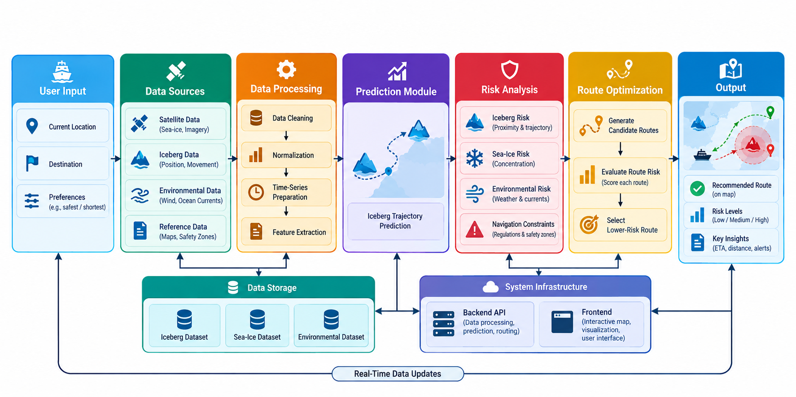
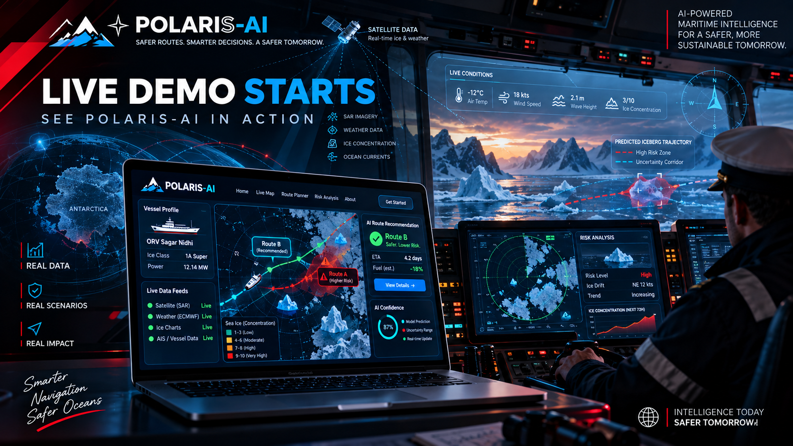
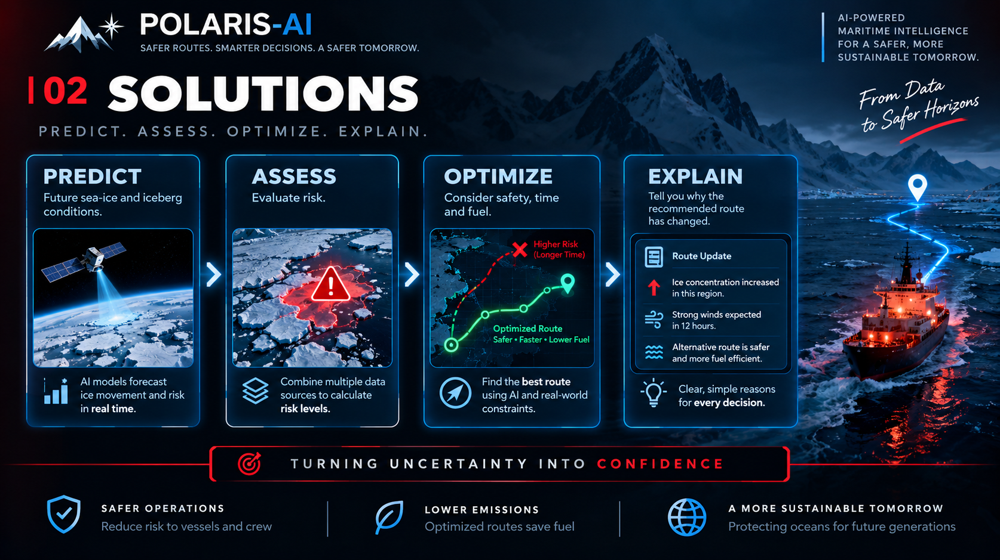
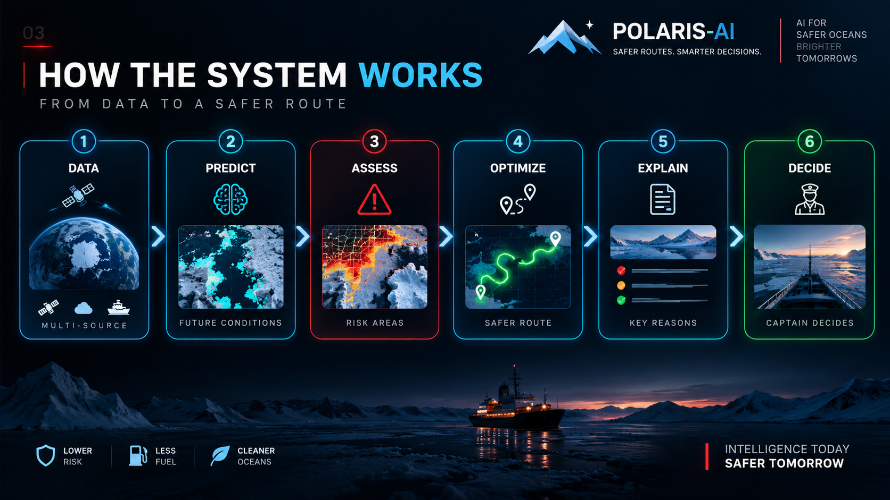
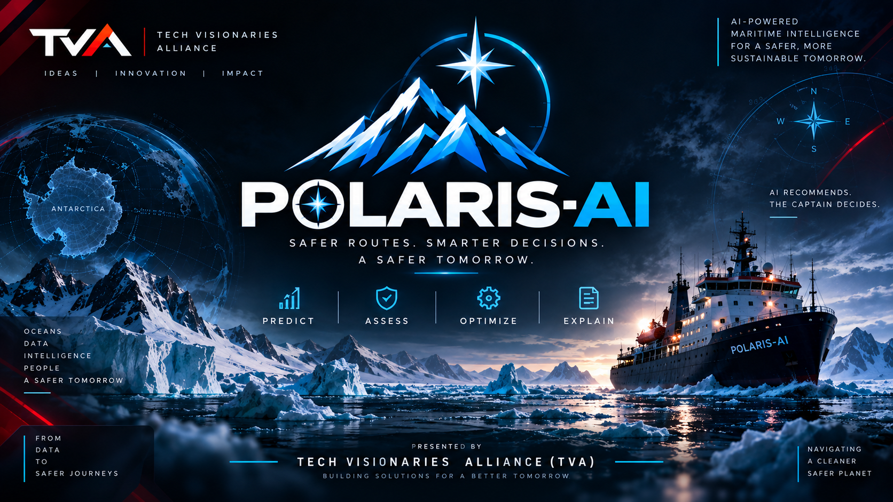
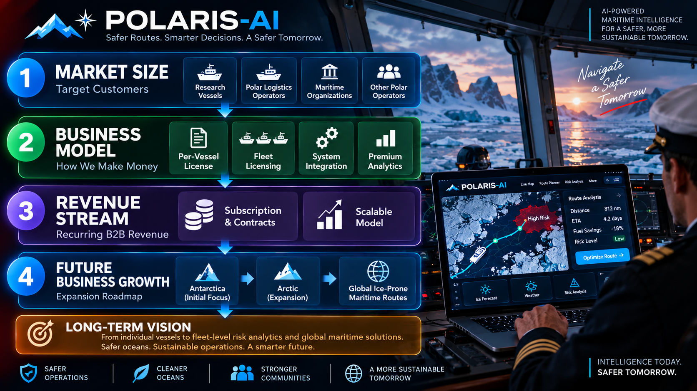

# POLARIS-AI

> **AI-Powered Polar Maritime Intelligence & Tactical Decision Support**  
> *Safer Routes. Smarter Decisions. A Safer Tomorrow.*  
> **Presented by:** Tech Visionaries Alliance (TVA)  
> **Core Principle:** *"AI Recommends. The Captain Decides."*

---

## Problem Statement

Navigating polar and ice-infested waters (such as the Southern Ocean and Antarctica) is among the most hazardous maritime operations in the world. Rapidly shifting pack ice, drifting icebergs, extreme sub-zero weather, and dynamic ocean currents create hostile environments where conditions can deteriorate within hours.

Current marine navigation and bridge systems face fundamental limitations:
1. **Static and Delayed Situational Awareness**: Conventional systems display *where hazards are right now* based on hours-old satellite passes or static ice charts. They fail to answer the captain's primary tactical question:  
   > *"Where will that hazard be when my vessel arrives in that area 24 to 48 hours from now?"*
2. **Catastrophic Operational Hazards**: Inaccurate route planning leads to hull-crushing besetment in heavy pack ice, devastating collisions with drifting icebergs, extensive structural damage, or emergency icebreaker salvage operations costing millions of dollars.
3. **Environmental & Emission Penalties**: Maneuvering through sub-optimal, high-resistance ice regimes spikes fuel consumption drastically, threatening regulatory compliance under the International Maritime Organization (IMO) Carbon Intensity Indicator (CII) standards.
4. **The "Black Box" Trust Barrier**: Fully autonomous navigation algorithms are impractical and legally unacceptable in polar operations. Shipmasters and bridge teams reject automated recommendations unless the underlying reasoning, hazard clearance margins, and spatial uncertainties are transparently explained.

**POLARIS-AI bridges this critical gap** by transitioning polar navigation from reactive hazard avoidance to proactive, explainable tactical intelligence.

---

## Project Description

**POLARIS-AI** is a next-generation polar maritime tactical decision-support system built around a strict **Human-in-the-Loop (HITL)** architecture. Designed for polar research vessels, icebreakers, and high-latitude logistics expeditions, POLARIS-AI synthesizes multi-source satellite telemetry, oceanographic forecasts, and vessel characteristics to predict hazards, evaluate risks, optimize routes, and explain every tactical recommendation.

### The 4-Pillar Decision Framework

```
    ┌──────────────┐       ┌──────────────┐       ┌──────────────┐       ┌──────────────┐
    │ 01. PREDICT  │ ────> │  02. ASSESS  │ ────> │ 03. OPTIMIZE │ ────> │ 04. EXPLAIN  │
    │ Ice & Drift  │       │ Dynamic RIO  │       │ Safety vs    │       │ AI Reasoning │
    │ Trajectories │       │ Risk Matrix  │       │ Time & Fuel  │       │ & Rationale  │
    └──────────────┘       └──────────────┘       └──────────────┘       └──────────────┘
                                                                                 │
                                                                                 ▼
                                                                     ┌──────────────────────┐
                                                                     │     05. DECIDE       │
                                                                     │ The Captain Decides  │
                                                                     └──────────────────────┘
```

1. **PREDICT (Trajectory & Environmental Forecasting)**:
   - Evaluates multi-source feeds: Synthetic Aperture Radar (SAR) imagery, ECMWF weather forecasts, sea-ice concentration charts, and ocean current velocity.
   - Forecasts iceberg drift paths and moving ice concentrations 24–72 hours into the future, establishing an explicit **spatial uncertainty corridor** around each hazard.
2. **ASSESS (Dynamic Risk Evaluation & IMO Compliance)**:
   - Implements the IMO Polar Code **POLARIS** (*Polar Operational Limit Assessment Risk Indexing System*).
   - Computes real-time **Risk Index Outcome (RIO)** scores per waypoint based on ice regime type (e.g., thick first-year ice, multi-year ice) and vessel ice class (e.g., Category B / 1A Super).
   - Classifies routes into transparent risk tiers:
     - **$\text{RIO} \ge 10$**: `SAFE` (Unrestricted operation)
     - **$\text{RIO} \in [0, 9]$**: `CAUTION` (Monitored transit / speed reduction)
     - **$\text{RIO} < 0$**: `PROHIBITED` / `HIGH RISK` (Requires immediate re-planning)
3. **OPTIMIZE (Multi-Objective Tactical Route Planning)**:
   - Continuously computes and benchmarks candidate routes against multi-variable constraints: hazard clearance distance, total voyage duration, engine power demands, and fuel consumption.
   - When forward hazard probability escalates on the current trajectory (**Route A**), the engine dynamically synthesizes a verified alternative (**Route B**) providing superior safety clearance while optimizing voyage economics and IMO CII compliance.
4. **EXPLAIN (Explainable AI & Natural-Language Briefing)**:
   - Provides clear, natural-language operational debriefs detailing *why* a route recommendation or status changed (e.g., *"Predicted iceberg drift and 2.1 km uncertainty corridor approach Route A within the 12-hour arrival window; replan to Route B advised for +8.4 km clearance"*).
   - Empowers the master with total situational transparency rather than opaque automated commands.

### Operational Scenario: ORV Sagar Nidhi Expedition
The prototype models a real-world Antarctic voyage scenario based on India's Polar Ocean Research Vessel **ORV Sagar Nidhi** (*Category B / Ice Class 1A Super, 12.14 MW installed power*) operating in the Southern Ocean near the Larsemann Hills / Bharati Station coordinates (`-69.38° S, 76.19° E`):
- **Voyage Length**: 2,018 km
- **Nominal Duration**: 46.4 hours
- **Fuel Baseline**: 118,309,282 g (~118.3 tonnes)
- **Attained CII**: 3.88 (Compliant against Required 4.14 limit)
- **Live Hazard Simulation**: Interactive toggle dynamically spawns shifting ice regimes and drifting iceberg vectors across WP-01, WP-02, and WP-03, triggering real-time re-routing to Route B with trajectory confidence ratings.

---

## Google AI Usage

### Tools / Models Used

- **Google Gemini 1.5 Pro & Gemini 1.5 Flash**:
  - Multimodal reasoning engine for synthesizing multi-sensor polar satellite feeds, ice charts, and vessel telemetry.
  - Generates real-time, explainable tactical briefings and structured situational reports for the shipmaster.
- **Google AI Studio**:
  - Prototyping, prompt engineering, and few-shot conditioning with strict maritime domain rules (IMO Polar Code, standard marine vocabulary).
  - Structured JSON schema generation for deterministic Risk Index Outcome (RIO) calculation matrices and voyage compliance logs.
- **Google Cloud Vertex AI & TensorFlow**:
  - Trajectory prediction and spatiotemporal drift regression models trained on historical iceberg movement, wind vectors, and ocean currents with uncertainty corridor quantification.
- **Google Earth Engine (GEE)**:
  - Geospatial processing and remote-sensing analysis pipeline for Sentinel-1 Synthetic Aperture Radar (SAR) sea-ice imagery and MODIS reflectance data.

---

## Tech Stack used

- **Frontend & UI**:
  - React 18
  - Vite 6
  - Modern Cyber-tactical CSS3 (Responsive Grid, Maritime Glassmorphism, HUD telemetry indicators)
- **Artificial Intelligence & Machine Learning**:
  - Google Gemini 1.5 Pro (via Google AI Studio & Gemini API)
  - Google Cloud Vertex AI
  - TensorFlow & Keras (Drift & Trajectory Time-Series Prediction)
  - Google Earth Engine API (Geospatial Ice Regime Analysis)
- **Maritime Standards & Protocol Compliance**:
  - IMO Polar Code (POLARIS - Polar Operational Limit Assessment Risk Indexing System)
  - Risk Index Outcome (RIO) Scoring Algorithm
  - IMO Carbon Intensity Indicator (CII) Emission Framework
  - Standard Marine Communication Phrases (SMCP) & GeoJSON waypoint schemes
- **Tooling & Environment**:
  - Node.js & npm
  - Python 3.13 (Telemetry analysis & verification scripts)

---

### How Google AI Was Used

Google AI serves as the core intelligence and reasoning backbone of POLARIS-AI across four integrated dimensions:

1. **Explainable AI (XAI) for Tactical Command Decisions**:
   Maritime navigators cannot act on automated decisions without knowing the operational rationale. Using **Google Gemini 1.5 Pro**, POLARIS-AI ingests multi-variable telemetry (current vessel heading, speed, waypoint ice concentration, nominal ice thickness, and projected iceberg vectors) and produces natural-language tactical explanations answering:
   - *Why did the route change?*
   - *What is the confidence level and uncertainty radius of the hazard?*
   - *What are the specific trade-offs between safety clearance, ETA delay, and fuel consumption?*
2. **IMO Polar Code Compliance & Structured Output Generation**:
   Via **Google AI Studio**, system prompts were engineered and conditioned against the International Maritime Organization (IMO) Polar Code regulations. Gemini 1.5 Pro evaluates vessel ice class ratings (e.g., Category B, 1A Super) against observed ice thickness and concentration to output valid, structured JSON containing exact RIO scores, operational permissions (`SAFE`, `CAUTION`, `PROHIBITED`), and compliant alternative corridors.
3. **Predictive Iceberg Trajectory & Uncertainty Modeling**:
   Using **TensorFlow models hosted on Google Cloud Vertex AI**, the system ingests ocean current vectors and wind velocities to forecast where drifting tabular icebergs and ice floes will be when the vessel reaches each waypoint. Instead of a single deterministic line, the model computes an **uncertainty corridor** (e.g., 2.1 km radius at 82% confidence) so bridge officers can maintain safe clearance margins.
4. **Multi-Source Geospatial Synthesis**:
   Through **Google Earth Engine**, satellite radar imagery (Sentinel-1 SAR) is ingested to classify sea-ice concentrations (tenths from 0/10 to 10/10) independent of cloud cover or polar night conditions, feeding normalized real-time feature layers directly into the risk analysis pipeline.

---

### GitHub repo link of the project

[https://github.com/iamadarshsunil/POLARIS-AI](https://github.com/iamadarshsunil/POLARIS-AI)

---

## Proof of Google AI Usage

Verifiable artifacts, prompt traces, and API execution schemas demonstrating Google AI integration are included in the [`/proofs`](proofs/) folder:


- **[`proofs/README.md`](proofs/README.md)**: Architectural breakdown of Google AI Studio prompt engineering, Vertex AI trajectory pipelines, and Earth Engine satellite data workflows.

---

## Screenshots

The project screenshots and architectural diagrams are located in the [`/screenshots`](screenshots/) folder:

### 1. System Architecture
Comprehensive data ingestion, AI processing, risk calculation, and tactical output pipeline.


### 2. Operational Command HUD
Tactical bridge view displaying the Live Ice Regime Model, vessel telemetry (ORV Sagar Nidhi), waypoint risk grid, and dynamic Route A vs. Route B decision recommendation.


### 3. Solutions Framework (Predict, Assess, Optimize, Explain)
The end-to-end tactical workflow turning polar uncertainty into confident navigation.


### 4. End-to-End System Pipeline
From multi-source data ingestion to captain decision support.


### 5. Project Branding & Mission
POLARIS-AI — Polar Maritime Intelligence presented by Tech Visionaries Alliance (TVA).


### 6. Business Model & Growth Roadmap
Target market (Research vessels, polar logistics, maritime operators) and long-term expansion from Antarctica to Arctic and global ice-prone routes.


---

## Demo Video

Upload your demo video to Google Drive, ensure link sharing is set to *"Anyone with the link can view"*, and update the link below (maximum 3 minutes):

**[Watch Demo Video](https://drive.google.com/file/d/18PVmTnzY9_2CwtkTW1acS0Ti5VmqHDn1/view?usp=sharing)**

---

## Installation Steps

Follow these steps to run the POLARIS-AI prototype locally:

### Prerequisites
- **Node.js**: Version 18.0.0 or higher
- **npm**: Version 9.0.0 or higher
- Modern web browser (Chrome, Edge, Firefox, Safari)

### 1. Clone the Repository
```bash
git clone https://github.com/iamadarshsunil/POLARIS-AI.git
cd POLARIS-AI
```

### 2. Install Dependencies
```bash
npm install
```

### 3. Start the Development Server
```bash
npm run dev
```
After running this command, open your browser and navigate to the local server URL (typically `http://localhost:5173`).

### 4. Build for Production
To generate an optimized production bundle:
```bash
npm run build
```

### 5. Preview Production Build
```bash
npm run preview
```

---

## Interactive Prototype Guide

When running the application:
1. **Overview (Home)**: Explore the mission, core pillars, and high-latitude Antarctic mission context.
2. **Live Map (Operational HUD)**:
   - View the tactical ice grid with real-time waypoint data (`WP-01`, `WP-02`, `WP-03`).
   - Click **"Simulate New Hazard ↻"** to inject a dynamic shifting iceberg hazard.
   - Observe how the AI decision status instantly flips from `ROUTE A · CAUTION` to `REPLAN TO ROUTE B · HIGH RISK`, recalculating hazard clearance from 8.4 km to 2.6 km, expanding the uncertainty bar to 78%, and generating the natural-language explainability brief.
   - Click **"Reset Scenario ↺"** to return to nominal conditions.
3. **Route Planner**: Compare Route A vs. Route B metrics including distance, clearance margin, voyage hours, and fuel efficiency trade-offs.
4. **Risk Analysis**: Inspect the IMO Polar Code RIO calculation engine and threshold standards (`SAFE`, `CAUTION`, `PROHIBITED`).
5. **About**: Review the TVA team mission and Human-in-the-Loop design philosophy.

---

## Team & Attribution

**Tech Visionaries Alliance (TVA)**  
*Building AI solutions for a safer, more sustainable tomorrow.*  
*AI recommends; the captain decides.*
